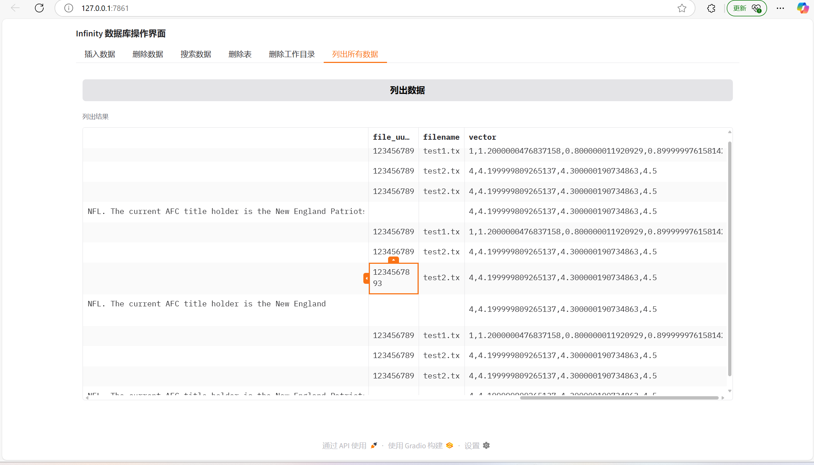

# Gradio-Infinity

## Introduction
The `Gradio-Infinity` project provides a Gradio - based graphical user interface for interacting with the Infinity database. The `interface.py` file is used to start the project, allowing users to perform various database operations through an intuitive interface.

## How to Start the Project Using `interface.py`

### Prerequisites
- Make sure you have Python installed on your system.
- Install the necessary dependencies. You can install them using the following command if you have a `requirements.txt` file:
```bash
pip install -r requirements.txt
```
- The project currently only supports Linux. If you are using a non - Linux environment, you need to manually compile it (see [Issue #1286](https://github.com/infiniflow/infinity/issues/1286)).

### Starting the Project
1. Navigate to the project directory in the terminal.
2. Run the following command to start the Gradio interface:
```bash
pip install infinity-embedded-sdk==0.6.0.dev3
```
3. Once the script is running, you will see an output indicating that the Gradio interface has been launched. Open the provided URL in your web browser to access the interface.

### Using the Gradio Interface
The Gradio interface provides several tabs for different database operations:

#### Insert Data
- Enter the `File UUID`, `filename`, `chunk_text`, and `vector` in the corresponding text boxes. The `vector` should be a 768 - dimensional vector, separated by commas.
- Click the "插入数据" (Insert Data) button. The result of the insertion will be displayed in the output text box.

#### Delete Data
- Enter the deletion condition in the text box.
- Click the "删除数据" (Delete Data) button. The result of the deletion will be shown in the output text box.

#### Search Data
- Enter the search vector (768 - dimensional, separated by commas), `filename`, and the number of results to return (`top_k`).
- Click the "搜索数据" (Search Data) button. The search results will be displayed in a dataframe.

#### Delete Table
- Click the "删除表" (Delete Table) button. The result of the table deletion will be shown in the output text box.

#### Delete Work Place
- Click the "删除工作目录" (Delete Work Directory) button. The result of the deletion will be displayed in the output text box.

#### List All Data
- Click the "列出数据" (List Data) button. All the data in the table will be listed in a dataframe if the table exists.


# Detailed Introduction to Infinity Database

Infinity is a high - performance database focusing on vector data processing. It combines the capabilities of traditional databases with advanced indexing technologies, making it suitable for large - scale vector retrieval and hybrid search scenarios. The following is an in - depth introduction from the aspects of core functions, indexing capabilities, unique advantages, algorithm references, and limitations:

## I. Core Functions of Traditional Databases
Infinity retains the basic operation capabilities of relational databases, supporting multi - dimensional data management:
- **Basic Data Operations**:
    It provides Create, Read, Update, and Delete (CRUD) operations at the **database/table/column** granularity, which is compatible with the conventional processing logic of structured data.
- **Data Processing Capabilities**:
    It supports data grouping, pagination, and keyword highlighting, meeting the requirements of complex queries and data presentation.

## II. Index Support Capabilities
### 2.1 Diverse Index Types
Infinity supports a variety of indexing technologies, adapting to different data forms and business scenarios:
- **Vector Indexes**:
    - **HNSW**: It supports hyperparameter tuning (such as the number of connections `M` and the number of candidate neighbors `ef_construction`), optimizing the retrieval efficiency of high - dimensional vectors.
    - **IVF**: It supports scalar quantization and product quantization, providing storage optimizations such as `int8/uint8/float16/bfloat16` to reduce memory usage.
- **Text Indexes**:
    - **FullText**: It integrates multi - language analyzers (Standard analyzer, RAGFLOW tokenizer, IK tokenizer, etc.) and supports boolean expression search (similar to Elasticsearch), adapting to complex text queries.
- **Structured Indexes**:
    - **Secondary**: It is suitable for standard structured data tables, accelerating equal - value/range queries.
    - **BMP**: It is a relational index based on bitmap storage, optimizing the performance of multi - condition filtering scenarios.

### 2.2 Multi - level Indexing and Optimization
- It supports **multi - level index combinations** (such as vector index + text index), enabling efficient queries in hybrid retrieval scenarios.
- It provides an automatic index optimization mechanism, dynamically adjusting index parameters according to data distribution and query patterns, reducing the cost of manual tuning.

## III. Core Advantage Features
### 3.1 Flexible Filtering and Fusion Capabilities
- **Filter Capability**: It supports complex conditional filtering (such as numerical range, text matching), accurately screening the target data subset.
- **Fusion Capability**: It has built - in algorithms such as **RRF (Re - ranking with Reciprocal Rank Fusion)** and **Weighted Sum** for sorting, integrating the retrieval results of multiple indexes to improve the accuracy of hybrid search.

### 3.2 Deep Integration of Re - ranking Technology
- It supports **fine - grained re - ranking (Rerank)** based on Transformer - Tensor, seamlessly integrating deep learning models (such as BERT, Sentence - BERT) to optimize the relevance of retrieval results.

### 3.3 Diverse Deployment and Invocation Methods
- **Deployment Modes**: It supports both embedded and HTTP service modes, adapting to edge devices (embedded) and distributed clusters (HTTP) scenarios.
- **Client Support**: It provides native Python interfaces and HTTP APIs, facilitating multi - language development and cross - platform invocation.
- **Distributed Expansion**: It supports a horizontally scalable architecture to handle high - concurrency retrieval requirements for data at the scale of hundreds of millions.

### 3.4 Comprehensive Performance Evaluation
- It provides detailed **Benchmark reports** (see [Infinity Evaluation Documentation](https://infiniflow.org/docs/benchmark)), validating performance based on public datasets such as SIFT1M.
- Actual measurement data: After vectorizing 1 million 128 - dimensional vector data, the disk space only expands by **1.34 times**, leading in storage efficiency.

## IV. Search Algorithm Selection Reference
According to the deployment environment (device energy consumption), search scenario (real - time/accuracy requirements), and downstream tasks (recommendation, Q&A, etc.), you can refer to the following resources to select algorithms:
- [Multi - Retrieval Algorithm Evaluation of Infinity](https://infiniflow.org/blog/multi - way - retrieval - evaluations - on - infinity - database): It analyzes the performance of algorithms such as HNSW and IVF on different datasets.
- [Hybrid Search Optimization Practice](https://techcommunity.microsoft.com/t5/ai - azure - ai - services - blog/azure - ai - search - outperforming - vector - search - with - hybrid/ba - p/3929167#searchconfiguration): Learn from Microsoft's engineering experience in hybrid retrieval (vector + text).

## V. Limitations and Precautions
### 5.1 Platform Compatibility Limitations
- **Only Supports Linux**: It does not support Windows/macOS for now. You need to manually compile it to adapt to non - Linux environments (see [Issue #1286](https://github.com/infiniflow/infinity/issues/1286)).

### 5.2 Query Optimization Depends on Manual Work
- It lacks an automatic query optimizer. In complex business scenarios, developers need to optimize table structures and SQL statements, which is not suitable for complex queries with high - performance requirements.

### 5.3 Lack of Logs in Embedded Mode
- The Embedded mode does not have a built - in logging system. External tools need to be additionally integrated for fault troubleshooting and performance monitoring.

### 5.4 Low Community Activity
- The open - source community is currently less active. The speed of feature iteration and problem response may be limited, which is more suitable for teams with strong independent technical capabilities.